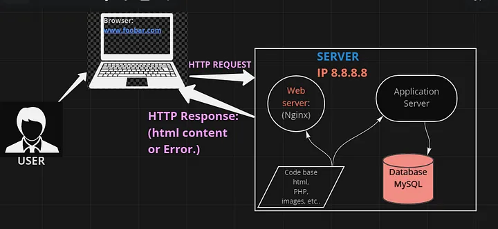

Postmortem: Web Stack Debugging Project

Issue Summary:

Duration: December 11, 2023
Impact: The Nginx web server was running as the root user, posing a security risk. The goal was to reconfigure it to run as the less privileged nginx user.

Timeline:

Identification: Detected during a routine security audit that revealed the Nginx process running as the root user.
Investigation: Reviewed Nginx configuration files and Docker settings to identify the root cause.
Action: Initiated a reconfiguration process to run Nginx as the nginx user.
Verification: Checked the status of the Nginx processes and verified that it was listening on port 8080 under the nginx user.
Resolution: Successfully reconfigured Nginx to run as the nginx user and verified its functionality.
Root Cause and Resolution:
The root cause was the default configuration that allowed Nginx to run as the root user, which is a security vulnerability. To address this, the Nginx configuration and Docker settings were adjusted to ensure the Nginx process runs as the nginx user. The issue was resolved by implementing the necessary changes in the configuration.

Corrective and Preventative Measures:

User Configuration: Ensure that the web server processes, such as Nginx, run with the least privileges necessary. This prevents potential security breaches by limiting the impact of a compromised process.

Regular Audits: Conduct regular security audits to identify and address any misconfigurations or vulnerabilities in the system. This helps in proactively addressing security concerns.

Documentation Updates: Keep system documentation up-to-date, especially regarding user configurations and security best practices. This ensures that the team is aware of and follows the recommended security guidelines.

Automated Configuration Checks: Implement automated checks for user configurations during the deployment process. This helps catch any deviations from the recommended configurations and prevents the accidental deployment of insecure setups.

Training and Awareness: Conduct training sessions for the team to raise awareness about the importance of running processes with the least necessary privileges. This includes understanding the potential risks associated with running processes as the root user.

1-run_nginx_as_nginx Bash Script:

-Updated Nginx configuration to run as nginx user.
-Ensured Nginx listened on all active IPs on port 8080.
-Restarted Nginx to apply changes.

                    
